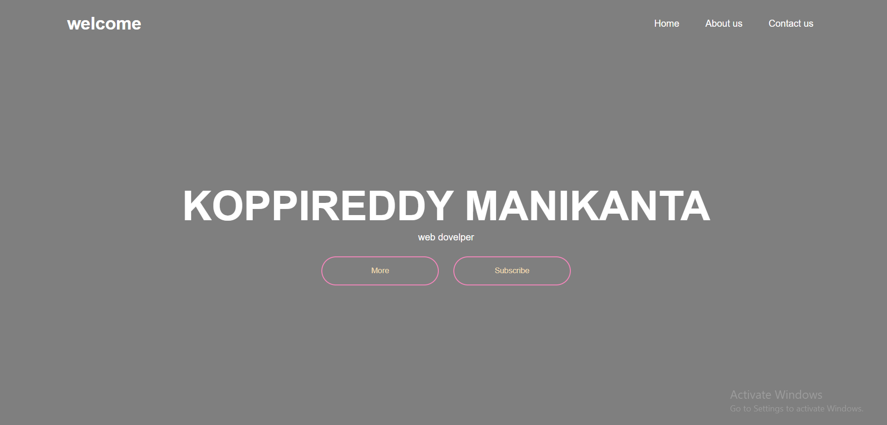
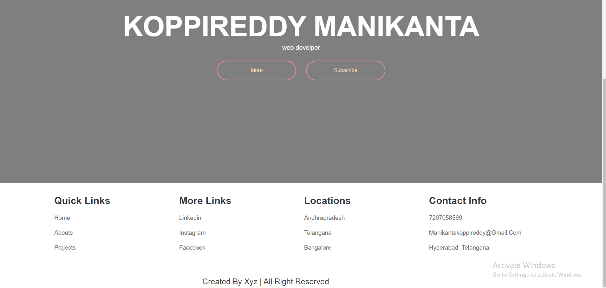

# Simple Website Home Page

This is a simple website homepage project with a basic HTML and CSS structure.

## Technologies Used
* HTML
* CSS

## Setup

To run this project, simply open the index.html file in your browser.

## Features

This website features a simple navigation bar, a welcome section with a button to subscribe, and a footer with quick links, social media links, location links, and contact information.

## Screenshot

